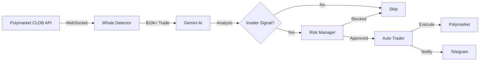

# 🐋 Polymarket Whale Bot

**AI-powered 24/7 whale trade detector and auto-trading bot for Polymarket**

[](https://cloud.google.com/run)
[](https://ai.google.dev/)
[](https://www.python.org/)

---

## 🎯 What It Does

Detects **$10,000+ trades** on Polymarket in real-time, analyzes them with **Google Gemini AI**, and optionally executes **automatic copy-trading** based on insider trading patterns.

### Key Features

- 🐋 **Whale Detection**: Real-time monitoring of large trades ($10k+)
- 🤖 **AI Analysis**: Gemini Pro analyzes wallet age, market niche, and trading patterns
- 📊 **Risk Management**: Daily limits on bets, amounts, and losses
- 📱 **Telegram Alerts**: Instant notifications with detailed analysis
- 🎯 **Auto-Trading**: Semi-auto (alerts) or full-auto (copy-trading) modes
- ☁️ **Cloud Deployment**: 24/7 operation on Google Cloud Run

---

## 🚀 Quick Start

### Prerequisites

- Google Cloud account
- Telegram bot token
- Google AI API key (included with Google One AI Premium)
- (Optional) Polymarket wallet for auto-trading

### 1. Clone & Setup

```powershell
cd d:\projects\polymarket_monitor

# Copy environment template
Copy-Item .env.example .env

# Edit .env with your credentials
notepad .env
```

### 2. Deploy to Cloud Run

```powershell
# Install gcloud CLI first
# https://cloud.google.com/sdk/docs/install

# Deploy (semi-auto mode)
.\deploy_cloudrun.ps1 -ProjectId "your-gcp-project-id" -Mode "semi"
```

### 3. Start Receiving Alerts

Check your Telegram for the startup message! 🎉

---

## 📊 How It Works



### Detection Criteria

A trade is flagged as **suspicious** if:

1. **Amount**: ≥ $10,000
2. **Wallet Age**: ≤ 7 days (new wallet)
3. **Market Niche**: Rank > 50 (low volume market)

### AI Analysis

Gemini Pro evaluates:
- Historical wallet behavior
- Market context
- Price extremes (0.01 or 0.99)
- Timing patterns

**Output**: `BET`, `SKIP`, or `MONITOR` with confidence score

---

## 🎮 Operating Modes

### Semi-Auto (Recommended)

```env
BOT_MODE=semi
```

- ✅ Detects whales
- ✅ AI analysis
- ✅ Telegram alerts
- ❌ No auto-trading

**Use case**: Learning, strategy validation

### Full-Auto (Advanced)

```env
BOT_MODE=full
POLYMARKET_PRIVATE_KEY=your_key
POLYMARKET_FUNDER_ADDRESS=your_address
```

- ✅ Detects whales
- ✅ AI analysis
- ✅ **Automatic copy-trading**
- ✅ Telegram alerts

**Use case**: Proven strategy, hands-off operation

---

## 💰 Cost

| Service | Monthly Cost |
|---------|--------------|
| Google Cloud Run | ~$14 |
| Cloud Storage | ~$0.50 |
| Secret Manager | $0 (free tier) |
| **Total** | **~$14.50/month** |

*Actual cost may be lower with free tier credits*

---

## 📱 Telegram Alerts

### Whale Detection

```
🔴 WHALE DETECTED 🔴

💰 Amount: $50,000
📊 Side: BUY
💵 Price: 0.05

📍 Market: Will there be US military action in 2024?

👤 Wallet Analysis:
• Address: 0x1234567890ab...
• Age: 3 days
• New wallet: ✅ YES

📈 Market Analysis:
• Rank: #75
• Niche market: ✅ YES

🤖 AI Analysis:
• Insider probability: 85%
• Recommendation: 🎯 BET
• Reasoning: New wallet + niche market + large bet...

⚠️ Suspicion Level: HIGH (0.85)
```

### Daily Report

```
📊 DAILY REPORT 📊

💰 Performance:
• Total bets: 3
• Total wagered: $150.00
• Net profit: 📈 $+25.50
• Win rate: 66.7%
• Wins: 2 | Losses: 1

🤖 AI Analysis:
Today's performance was strong with...
```

---

## ⚙️ Configuration

### Risk Limits

```env
MAX_BET_AMOUNT=50      # Max $50 per trade
MAX_DAILY_BETS=5       # Max 5 trades per day
MAX_DAILY_LOSS=200     # Stop if daily loss > $200
```

### Detection Thresholds

```env
WHALE_THRESHOLD=10000  # Minimum trade size to detect
```

---

## 📁 Project Structure

```
polymarket_monitor/
├── main_bot.py              # Main orchestrator
├── whale_detector.py        # Trade detection
├── gemini_analyzer.py       # AI analysis
├── risk_manager.py          # Risk management
├── auto_trader.py           # Trading execution
├── telegram_notifier.py     # Alerts
├── config.py                # Configuration
├── health_check.py          # Cloud Run health endpoint
├── deploy_cloudrun.ps1      # Deployment script
├── Dockerfile.cloudrun      # Cloud Run container
├── requirements.txt         # Python dependencies
├── .env.example             # Environment template
├── CLOUDRUN_GUIDE.md        # Deployment guide
└── logs/                    # Log files
```

---

## 🔧 Local Development

```powershell
# Create virtual environment
python -m venv venv
.\venv\Scripts\Activate.ps1

# Install dependencies
pip install -r requirements.txt

# Run locally
python main_bot.py
```

---

## 📊 Monitoring

### View Logs

```powershell
# Real-time logs
gcloud run services logs tail polymarket-whale-bot --region=us-central1

# Recent logs
gcloud run services logs read polymarket-whale-bot --region=us-central1 --limit=50
```

### Cloud Console

Visit [Cloud Run Console](https://console.cloud.google.com/run) to view:
- CPU/Memory usage
- Request metrics
- Error rates
- Logs

---

## ⚠️ Legal Disclaimer

1. **Financial Risk**: All trading involves risk of loss
2. **Terms of Service**: May violate Polymarket ToS
3. **Regulatory Risk**: Check local gambling/prediction market laws
4. **Tax Obligations**: Report profits to tax authorities

**Use at your own risk. This is for educational purposes only.**

---

## 🛠️ Troubleshooting

### Bot Not Responding

```powershell
# Check logs
gcloud run services logs read polymarket-whale-bot --region=us-central1 --filter="severity=ERROR"

# Restart service
gcloud run services update polymarket-whale-bot --region=us-central1
```

### Deployment Failed

```powershell
# Check build logs
gcloud builds log --region=us-central1

# Verify secrets
gcloud secrets list
```

---

## 📈 Roadmap

- [ ] Multi-market support
- [ ] Advanced ML models
- [ ] Backtesting framework
- [ ] Portfolio optimization
- [ ] Discord integration

---

## 📝 License

MIT License - See LICENSE file

---

## 🙏 Acknowledgments

- [Polymarket](https://polymarket.com) - Prediction market platform
- [Google Gemini](https://ai.google.dev/) - AI analysis
- [py-clob-client](https://github.com/Polymarket/py-clob-client) - Python client

---

**Built with ❤️ for the Polymarket community**

*Happy whale hunting! 🐋*
